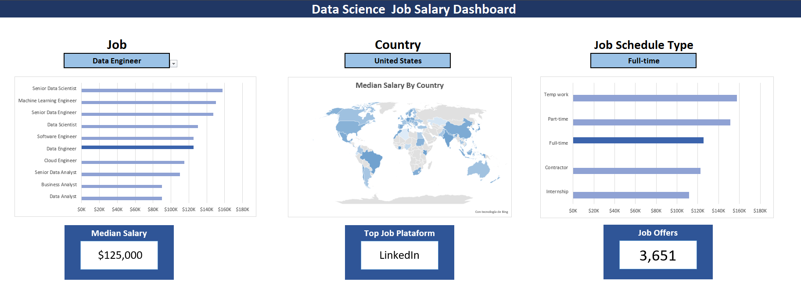
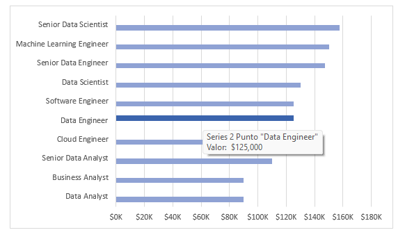

# 📊 Excel Data Analytics: Job Market Dashboard 2023

## 📖 Introduction

This project was developed as a practical component of the **"Excel for Data Analytics"** course by [Luke Barousse](https://www.youtube.com/@LukeBarousse). The primary goal is to apply and consolidate data analysis and visualization concepts learned in the first part of the course.

The project involves designing an interactive dashboard using a dataset of data-related job postings published throughout 2023.

### 🎯 Dashboard Purpose
The dashboard provides referential insights into the data job market, focusing on:
* **Median Salary** based on job titles (providing a more accurate central tendency than averages).
* **Work Modality** (Remote, On-site, Hybrid).
* **Geographic Distribution** (Top countries by job volume and pay).

> [!TIP]
> **Design Enhancement:** Unlike the course's original example, I implemented custom formatting and layout modifications to align with **Data Visualization best practices**, focusing on reducing cognitive load and improving readability.

---

## 🛠️ Dashboard Development

This section details the visual components designed to turn raw data into actionable insights:

### 📶 Bar Chart: Median Salary by Job Title
* **Tools:** Native Excel Charts with optimized X-axis formatting and element cleanup.
* **Design:** Horizontal orientation to facilitate effortless comparison between long job titles.
* **Hierarchy:** Data is sorted in **descending order** based on median salary for instant comprehension of top-paying roles.
* **Insights:** Enables quick identification of salary patterns across different seniority levels and roles.

### 🗺️ Map: Median Salary by Country
* **Tools:** Excel Map Charts used to visualize salary distribution globally.
* **Representation:** A monochromatic blue scale highlights countries with available data, ensuring visual focus.
* **Insights:** Clearly identifies geographic regions offering the most competitive salaries in the data sector.

---

## 💾 Dataset

The data was curated by Luke Barousse, sourced from job postings on platforms such as **LinkedIn** and **ZipRecruiter**.

The source file was retrieved from the official course repository:
🔗 [Excel Data Analytics Course Repository](https://github.com/lukebarousse/Excel_Data_Analytics_Course)

### Key Dimensions:
* **Job Title:** The specific role designation.
* **Schedule Type:** Employment type (Full-time, Part-time, etc.).
* **Job Location:** The country where the position is based.
* **Job Skills:** Technical skills requested by employers.

---

## 🚀 How to View the Project

1.  Clone this repository or download the `.xlsx` file.
2.  Open the file using **Microsoft Excel** (2019 or newer recommended).
3.  Interact with the **Slicers** on the dashboard to filter by country or role and see real-time updates.

---

## 💡 Credits

- **Instructor:** [Luke Barousse](https://www.lukebarousse.com/)
- **Course Reference:** [Excel for Data Analytics (YouTube Series)](https://www.youtube.com/watch?v=pCJ15nGFgVg&list=PL_CkpxkuPiT-RJ7zBfHVWwgltEWIVwrwb)
